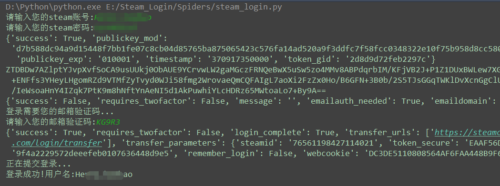

Python实现Steam游戏平台的模拟登录 
===========================
   
### Steam游戏平台 - https://store.steampowered.com/
|Author|:sunglasses:Henryhaohao:sunglasses:|
|---|---
|Email|:hearts:1073064953@qq.com:hearts:

      
****
## :dolphin:声明
### 软件均仅用于学习交流，请勿用于任何商业用途！感谢大家！
## :dolphin:介绍
### 该项目为[Steam游戏平台](https://store.steampowered.com/)的模拟登录
- 爬虫文件:Spiders目录下的steam_login.py
- Password密码解密文件:Spiders目录下的rsa.js
## :dolphin:运行环境
Version: Python3
## :dolphin:安装依赖库
```
pip3 install -r requirements.txt
```
## :dolphin:**运行截图**
> - **Steam官网 - https://store.steampowered.com/**<br><br>


> - **运行过程**<br><br>



